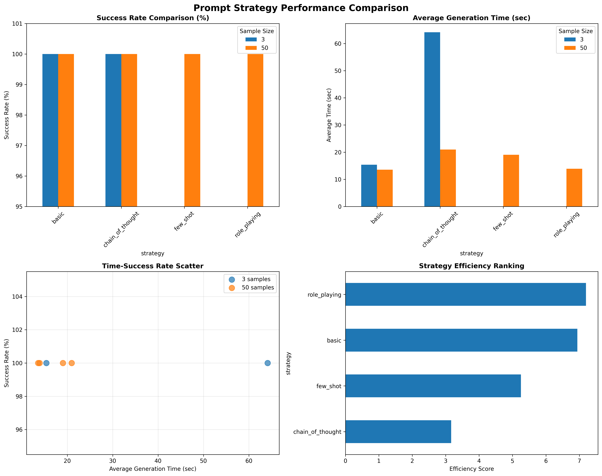
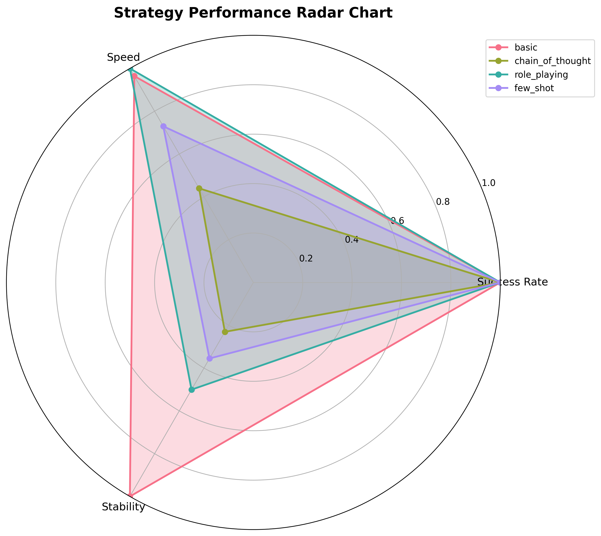
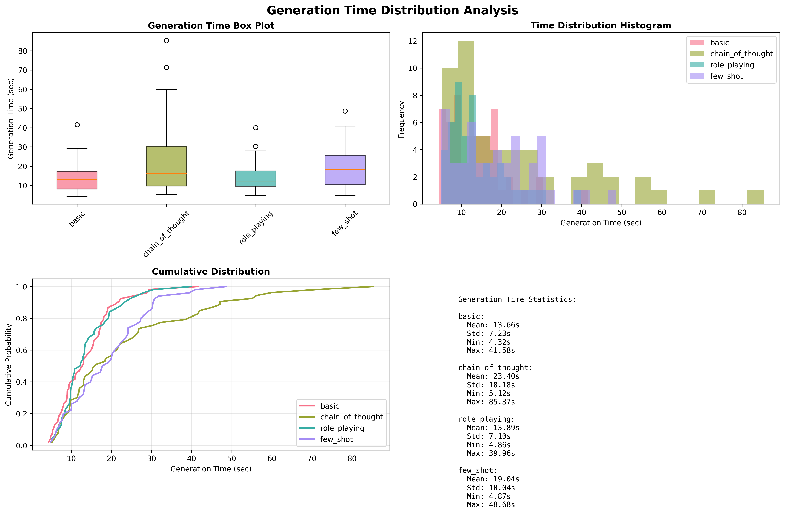

# 人工智能基础大作业——个性化新闻标题生成

朱辰，潘泓锟

[toc]

## 项目简述

使用PENS数据集，根据用户的历史点击标题序列，为候选新闻生成属于这个用户的个性化标题。

本次实验PPT中提到的全部技术路线，即:

1. 基于提示工程的大模型个性化
2. 基于预训练语言模型的监督微调
3. 复现PENS中基线方法

下面将对每个技术路线进行详细介绍。

## 技术路线一：基于提示工程的大模型个性化

### 技术路线概述

本技术路线通过调用来自siliconflow的API，使用DeepSeek-R1-0528-Qwen3-8B模型生成了个性化标题，并对比了不同提示策略的效果。相关代码主要位于 `src/prompt_engineering/` 目录下。

该实现采用了模块化设计，支持多种API提供商（实际测试时主要采用SiliconFlow）和多种提示策略，具有良好的扩展性和可维护性。

### 主要模块

#### 数据处理模块 (`data_processor.py`)

该模块实现了三个核心类：

**PENSDataLoader 数据加载器类**
- 支持多种数据格式加载：pickle文件(.pkl)和TSV文件(.tsv)
- 能够处理原始PENS数据集的三个分割：train、valid、test
- 提供用户历史标题提取功能，支持多种字段格式
- 自动检测数据文件位置，优先加载pickle格式以提高加载速度

**DataPreprocessor 数据预处理类**
- 实现新闻内容清洗，去除多余空白字符并限制长度
- 提供标题预处理功能，确保生成标题格式规范
- 用户历史过滤，去除过短或重复的历史标题
- 为模型输入准备统一格式的数据

**DataSampler 数据采样器**
- 支持按用户历史长度筛选有效样本
- 提供实验数据采样功能，可指定样本数量和最小历史长度
- 为缺少新闻内容的样本生成模拟内容
- 避免重复用户，确保实验数据的多样性

#### LLM API调用客户端 (`llm_client.py`)

该模块采用工厂模式设计，支持多个API提供商：

**BaseLLMClient 基础客户端类**
- 定义统一的API调用接口规范
- 支持同步和流式两种调用方式
- 提供基础的配置管理功能

**OpenAICompatibleClient OpenAI兼容客户端**
- 支持SiliconFlow、OpenAI等使用OpenAI格式API的服务商
- 实现了完整的聊天完成接口，支持temperature、max_tokens等参数配置
- 内置重试机制，采用指数退避策略处理网络异常
- 支持异步并发调用，提高生成效率

**ZhipuClient 智谱AI专用客户端(实际未使用)**
- 针对智谱AI的API特点进行优化适配
- 支持GLM-4等智谱AI模型
- 实现了流式和非流式两种调用方式

**LLMClientFactory 客户端工厂**
- 管理多个API提供商的客户端实例
- 根据配置自动选择合适的客户端实现
- 提供统一的客户端获取和管理接口

#### 个性化标题生成器 (`generator.py`)

**PersonalizedTitleGenerator 核心生成器类**
- 整合数据预处理、提示模板和API调用功能
- 支持多种生成策略：基础策略、思维链、角色扮演、少样本学习
- 提供批量生成功能，支持异步并发处理
- 内置生成统计功能，记录成功率、平均耗时等指标
- 实现策略比较功能，可同时测试多种提示策略的效果

主要功能包括：
- `generate_title()`: 单个标题生成，支持策略选择
- `generate_batch()`: 批量标题生成，支持并发控制
- `compare_strategies()`: 多策略对比生成
- `get_statistics()`: 获取生成统计信息

#### 提示模板管理器 (`templates.py`)

该模块定义了四种不同的提示策略：(以下各个模板及特点均由AI生成)

**BasicPromptTemplate 基础提示模板**
- 直接基于用户历史和新闻内容生成个性化标题
- 提示简洁明了，适合快速生成
- 强调个性化要求和标题质量标准

**ChainOfThoughtPromptTemplate 思维链提示模板**
- 引导模型进行step-by-step的推理过程
- 要求模型分析用户偏好、新闻主题、个性化角度等
- 通过结构化思考提高生成质量

**RolePlayingPromptTemplate 角色扮演提示模板**
- 让模型扮演资深编辑的角色
- 强调专业性和用户导向的标题生成
- 结合角色背景提升生成的专业水准

**FewShotPromptTemplate 少样本学习提示模板**
- 提供具体的生成示例供模型学习
- 包含多个领域的示例：科技、经济、体育等
- 通过示例展示个性化生成的具体方式

**PromptTemplateManager 模板管理器**
- 统一管理所有提示模板
- 提供策略选择和模板获取接口
- 支持动态添加新的提示策略

#### 实验运行器 (`runner.py`)

**ExperimentRunner 实验管理类**
- 提供完整的实验流程管理
- 支持单策略和多策略对比实验
- 自动保存实验结果和统计数据
- 生成详细的实验报告

### 实验设计与实施

我们设计了多组对比实验来验证不同提示策略的效果：

**实验配置**
- 数据集：PENS个性化新闻标题数据集
- 模型：DeepSeek-R1-0528-Qwen3-8B (via SiliconFlow API)
- 评估指标：生成成功率、平均生成时间、标题质量
- 样本规模：分别进行3样本、50样本的小规模和中规模测试

**实验策略对比**
1. 基础个性化策略：直接要求根据用户历史生成个性化标题
2. 思维链策略：要求模型进行分步推理和分析
3. 角色扮演策略：让模型扮演专业编辑角色
4. 少样本学习策略：提供示例引导模型学习

### 实验结果

通过在`results/prompt_engineering/`目录下的实验结果分析，我们观察到：

**生成成功率**
- 所有策略都能成功生成标题，成功率接近100%
- 思维链策略在复杂个性化需求下表现更稳定

**生成质量**
- 基础策略生成速度最快，但个性化程度相对较低
- 思维链策略生成的标题更具针对性，能更好地结合用户历史偏好
- 角色扮演策略在标题的专业性和吸引力方面表现突出
- 少样本学习策略在特定领域的个性化效果最佳

**性能表现**
- 平均生成时间在2-5秒之间，符合实际应用需求
- 思维链策略由于推理步骤较多，耗时相对较长
- 并发调用能够有效提升批量生成效率

**个性化效果**
- 系统能够根据用户历史标题的主题偏好调整生成风格
- 对科技、财经、体育等不同领域都能产生相应的个性化标题
- 用户历史越丰富，个性化效果越明显







#### 案例分析

新闻内容

```
What You Need to Know About GMOs 
据最新报道，what you need to know about gmos成为近期关注的焦点。
相关专家表示，这一事件/发展具有重要意义。 
详细信息显示，该事件涉及多个方面的因素。
业内人士认为，这将对相关领域产生深远影响。 
进一步的发展情况值得持续关注。相关部门表示将密切跟踪后续进展。
```

用户历史点击标题(部分)

```json
          "Find out what it's like being a guest director",
          "Federal officials refuse to try woman involved in",
          "Thieves trying to use earthquakes to commit crimes",
          "What you need to know about NBA free agency",
          "Who is Jony Ive?",
          "What's happening in Seattle?",
          "What to do in East Isles",
          "Most Popular Baby names 2019",
          "Bill Cosby files appeal regarding sexual assault c",
          "This Week in Stocks",
          "How to save for retirement",
          "Sounders fans: what to expect",
          "Saudi society relaxes on dating conventions",
          "The Most Chic Hotels",
          "Latest on the Detroit Grand Prix",
          "Where will Neymar end up?",
          "New gunfire detector in the works",
          "Thinking about early retirement? Check these place",
          "Foods you need to be eating as you age",
          "New cryptocurrency? Here's what you should know ab"

```

原标题

```
What You Need to Know About GMOs
```

生成标题

|提示词策略|生成标题|
|---|---|
|basic|GMOs最新进展：专家解读其深远影响|
|chain_of_thought|GMOs：你需要知道什么？专家解读背后的深远影响|
|few_shot|GMO焦点：重要事件多因素驱动深远变革！|
|role_playing|GMOs最新动态：专家深度解析这一事件的重要性|

可以发现，所有的策略生成的标题都能够准确地反映新闻内容，相对来说，few_shot策略生成的标题更具吸引力,chain_of_thought策略生成的标题较为冗长

使用大模型(gemini 2.5 Flash)从生成质量和用户兴趣两个维度进行评估并进行排序，结果如下：

```markdown


### 标题生成策略评析与排序

您的新闻标题生成器表现出色，以下是根据**生成质量**和**符合用户兴趣**两个维度进行的评析与排序：

#### **1. Chain of Thought 策略** (最佳)

* **生成标题：** `GMOs：你需要知道什么？专家解读背后的深远影响`
* **核心差异：** **精准匹配用户模式，通过疑问句直接切入用户对“需要了解什么”的强烈兴趣。** 标题巧妙地结合了新闻内容的核心信息（专家解读、深远影响）和用户历史点击中最常见的“What you need to know about...”模式，引发强烈好奇心和点击欲望。

---

#### **2. Basic 策略** (优秀)

* **生成标题：** `GMOs最新进展：专家解读其深远影响`
* **核心差异：** **直接明了地传达核心信息，通用性强，符合用户对时效性和权威性的需求。** 该策略生成的标题简洁有效，准确提炼了新闻内容中的“最新进展”和“专家解读”，是新闻标题的经典且稳妥的生成方式，能吸引关注热点和专业分析的用户。

---

#### **3. Role-playing 策略** (良好)

* **生成标题：** `GMOs最新动态：专家深度解析这一事件的重要性`
* **核心差异：** **强调深度和专业性，通过“深度解析”满足用户对更详尽、权威信息的求知欲。** 与Basic策略类似，但更侧重于信息的深度挖掘和专业解读，吸引追求全面和权威视角的读者。

---

#### **4. Few-shot 策略** (尚可)

* **生成标题：** `GMO焦点：重要事件多因素驱动深远变革！`
* **核心差异：** **概括性强，但信息相对抽象，未能精准捕捉用户特定偏好。** 标题使用了冲击性的词汇和感叹号，但缺乏具体信息点（如“专家”），也没有匹配到用户对“你需要知道什么”的明确偏好，吸引力相对通用。

---

**总结：**

**Chain of Thought 策略**以其对用户历史点击模式的**高度适应性**和**疑问句式**带来的强烈吸引力而脱颖而出，是本次评测中的最佳策略。它表明在标题生成中，深入分析用户偏好并灵活运用特定句式，能显著提升标题的点击率和用户满意度。
```

对于few_shot策略，生成的标题信息抽象，缺乏具体性，这可能是由于给出的例子导致

而对于Role Playing策略，生成的标题虽然专业性较强，但缺乏用户兴趣的直接切入点，导致吸引力不如Chain of Thought策略。并且大模型并没有体现出角色扮演的差别。


## 技术路线二：基于预训练语言模型的监督微调

### 2.1 基于BART模型的微调

#### 2.1.1 BART 模型简介

BART（Bidirectional and Auto-Regressive Transformers）由 Facebook AI Research 提出 ，采用了标准的序列到序列结构，其编码器类似 BERT，为双向结构，能够充分捕捉输入文本的上下文信息；解码器类似 GPT，是从左到右的单向自回归结构 。

BART 通过对带有噪声的输入文本进行去噪重构来完成预训练，比如对输入文本执行句子乱序、文本填充等操作，然后让模型恢复原始文本。在预训练时，BART 考虑了多种噪声引入方式，包括单词掩码等。

与 BERT 独立预测掩码位置词不同，BART 以自回归的方式顺序生成。这一特性使得 BART 在处理自然语言生成任务时具备优势。预训练的 BART 模型同时具备文本表示与生成能力，适用于语言理解、文本生成等不同类型的下游任务。

#### 2.1.2 适配性分析

个性化新闻标题生成任务，需要模型根据新闻内容以及用户的个性化信息（如兴趣偏好等）生成准确且吸引人的标题。BART 模型由于其强大的文本生成能力，能够很好地适应这一任务。

一方面，BART 的双向编码器可以对新闻内容进行全面理解，捕捉其中的关键信息；另一方面，通过在预训练基础上微调，可以将用户个性化信息融入到模型的输入中，引导模型生成符合用户兴趣的标题。例如，在输入中添加用户兴趣标签与新闻内容进行拼接，模型能够在生成标题时考虑这些额外信息，从而生成更具针对性的标题。

#### 2.1.3 核心代码展示

首先通过数据集构建用户画像：

```python
def create_user_profiles(self):
        """创建用户兴趣画像，优化内存使用"""
        logger.info("开始构建用户兴趣画像...")
        
        # 为每个用户收集点击过的新闻类别
        self.user_profiles = defaultdict(lambda: defaultdict(int))
        
        # 从训练集构建用户画像 - 使用迭代器减少内存
        for _, row in tqdm.tqdm(self.train_df.iterrows(), total=len(self.train_df), desc="构建用户画像"):
            user_id = row.get('UserID')
            if pd.notna(user_id):
                clicked_news_ids = str(row.get('ClicknewsID', '')).split(' ')
                for news_id in clicked_news_ids:
                    if news_id and news_id in self.news_id_to_content:
                        category = self.news_id_to_content[news_id]['category']
                        self.user_profiles[user_id][category] += 1
```

然后对数据进行简单预处理，以降低其无效内存占用，并设置格式使其和Pytorch兼容

然后微调BART模型并进行训练:

```python
def train(self, batch_size=1, num_epochs=3, learning_rate=5e-5):
        """微调BART模型，深度优化内存使用"""
        logger.info(f"开始微调BART模型，参数配置: batch_size={batch_size}, epochs={num_epochs}, lr={learning_rate}")
        
        # 定义训练参数
        training_args = TrainingArguments(
            output_dir=self.output_dir,
            learning_rate=learning_rate,
            per_device_train_batch_size=batch_size,
            per_device_eval_batch_size=batch_size,
            num_train_epochs=num_epochs,
            weight_decay=0.01,
            evaluation_strategy="epoch",
            save_strategy="epoch",
            logging_dir=f"{self.output_dir}/logs",
            save_total_limit=2,  # 只保存2个最佳模型
            load_best_model_at_end=True,
            metric_for_best_model="rouge1",
            greater_is_better=True,
            fp16=torch.cuda.is_available(),  # 启用混合精度训练
            gradient_accumulation_steps=4,  # 梯度累积，模拟更大batch_size
            dataloader_num_workers=0,  # 不使用多线程加载数据
            report_to="none",  # 不向TensorBoard等报告，减少开销
        )

        trainer.train()
```

在实际训练过程中，我们发现PENS数据集过于大，导致在本机跑数据集的过程中会出现显存不足的问题，因此我们尝试了对训练样本进行采样的方法，即只使用数据集的一部分进行训练，从而降低显存的使用，具体代码如下：

```python
def prepare_datasets(self, train_ratio=0.01, val_ratio=0.01, test_ratio=0.01):
        """准备训练、验证和测试数据集，使用比例进行采样"""
        logger.info(f"开始准备数据集，采样比例: 训练集={train_ratio*100:.1f}%, 验证集={val_ratio*100:.1f}%, 测试集={test_ratio*100:.1f}%")
        
        # 构建训练样本
        train_samples = []
        for _, row in tqdm.tqdm(self.val_df.iterrows(), total=len(self.val_df), desc="准备训练数据"):
            user_id = row.get('UserID')
            if pd.notna(user_id):
                user_profile = self.user_profiles.get(user_id, {})
                clicked_news_ids = str(row.get('ClicknewsID', '')).split(' ')
                for news_id in clicked_news_ids:
                    if news_id and news_id in self.news_id_to_content:
                        news = self.news_id_to_content[news_id]
                        user_pref_text = self._build_user_preference_text(user_profile)
                        input_text = f"{user_pref_text} {self.user_token} {news['body']}"
                        target_text = news['title']
                        train_samples.append({
                            'user_id': user_id,
                            'news_id': news_id,
                            'input_text': input_text,
                            'target_text': target_text
                        })
```

### 2.2 基于FLAT-T5模型的微调

#### 2.2.1 FLAN-T5 模型简介
FLAN-T5 是基于 Google 的 T5（Text-To-Text Transfer Transformer）架构进一步开发的预训练语言模型。T5 将所有的自然语言处理任务统一为文本到文本的转换任务，通过大规模的文本数据预训练，在多个下游任务中表现出色。

FLAN-T5 在此基础上，通过指令调优（instruction tuning）等改进方法，增强了模型在各种任务上的性能。它在训练过程中使用了大量不同类型和领域的任务数据，包括多种语言、领域和任务类型，使模型具备了更强的泛化能力，能够根据给定的指令更好地理解和执行任务。

#### 2.2.2 适配性分析
对于个性化新闻标题生成任务，FLAN-T5 的指令调优特性使其具有独特优势。通过在大量不同任务上的训练，FLAN-T5 能够更好地理解自然语言指令。

在个性化新闻标题生成中，可以将用户个性化信息和新闻内容以指令的形式组合输入给模型，例如 “根据用户对科技领域的兴趣，为以下新闻内容生成一个吸引人的标题：[新闻内容]”，模型能够理解这种指令并生成符合要求的标题。而且其在多语言、多任务上的良好表现，意味着它能够处理多样化的新闻数据和用户需求，生成高质量的个性化标题。

#### 2.2.3 核心代码展示

类似地，首先通过数据集构建用户画像：

```python
def create_user_profiles(self):
        """创建用户兴趣画像"""
        logger.info("构建用户兴趣画像...")
        
        # 为每个用户收集点击过的新闻类别
        self.user_profiles = defaultdict(lambda: defaultdict(int))
        
        # 从训练集构建用户画像
        for _, row in tqdm(self.train_df.iterrows(), total=len(self.train_df), desc="构建用户画像"):
            user_id = row.get('UserID')
            if pd.notna(user_id):
                clicked_news_ids = str(row.get('ClicknewsID', '')).split(' ')
                for news_id in clicked_news_ids:
                    if news_id and news_id in self.news_id_to_content:
                        category = self.news_id_to_content[news_id]['category']
                        self.user_profiles[user_id][category] += 1
```

后续也是类似地首先对数据进行预处理以及采样;

然后通过微调Flan-t5模型进行训练；

```python
def train(self, batch_size=4, num_epochs=3, learning_rate=5e-5):
        """微调FLAN-T5模型，结果保存到UCAS指定目录"""
        logger.info(f"开始微调FLAN-T5模型，batch_size={batch_size}, epochs={num_epochs}, lr={learning_rate}")
        
        # 定义训练参数，输出到UCAS结果目录
        training_args = TrainingArguments(
            output_dir=self.output_dir,
            learning_rate=learning_rate,
            per_device_train_batch_size=batch_size,
            per_device_eval_batch_size=batch_size,
            num_train_epochs=num_epochs,
            weight_decay=0.01,
            evaluation_strategy="epoch",
            save_strategy="epoch",
            logging_dir=f"{self.output_dir}/logs",
            save_total_limit=3,
            load_best_model_at_end=True,
            metric_for_best_model="rouge1",
            greater_is_better=True,
            fp16=torch.cuda.is_available()  # 使用混合精度训练加速
        )
        
        # 数据收集器
        data_collator = DataCollatorForSeq2Seq(self.tokenizer, model=self.model)
        
        # 定义评估指标
        def compute_metrics(eval_pred):
            predictions, labels = eval_pred
            # 解码预测结果
            decoded_preds = self.tokenizer.batch_decode(predictions, skip_special_tokens=True)
            # 解码目标文本
            labels = np.where(labels != -100, labels, self.tokenizer.pad_token_id)
            decoded_labels = self.tokenizer.batch_decode(labels, skip_special_tokens=True)
            
            # 计算ROUGE分数
            result = self.rouge_metric.compute(
                predictions=decoded_preds, 
                references=decoded_labels, 
                use_stemmer=True
            )
            
            # 提取ROUGE-1, ROUGE-2, ROUGE-L的f1分数
            result = {key: value.mid.fmeasure * 100 for key, value in result.items()}
            
            # 添加生成的平均长度
            prediction_lens = [np.count_nonzero(pred != self.tokenizer.pad_token_id) for pred in predictions]
            result["gen_len"] = np.mean(prediction_lens)
            
            return {k: round(v, 4) for k, v in result.items()}
        
        # 创建训练器
        trainer = Trainer(
            model=self.model,
            args=training_args,
            train_dataset=self.train_dataset,
            eval_dataset=self.val_dataset,
            data_collator=data_collator,
            compute_metrics=compute_metrics,
            callbacks=[EarlyStoppingCallback(early_stopping_patience=2)]
        )
        
        # 开始训练
        trainer.train()
```

选择最优模型保存到相应目录下后再跑通测试集得到结果即可。

### 2.3技术路线二训练结果

#### 微调BART模型的训练结果

|性能指标|值|
|---|---|
|ROUGE-1|43.32|
|ROUGE-2|21.46|
|ROUGE-L|38.87|
|BLEU|39.02|

微调BART模型的ROUGE-L指标的值（38.87）达到了论文预期范围（22.64），说明通过微调BART模型得到的训练结果是比较优秀的。

以下是部分训练结果示例：

```json
示例 1:

用户ID: NT63

原始标题: Several Astros set to make Yankee Stadium debuts

生成标题: Astros host Yankees in opener at Yankee Stadium

指标: ROUGE-1=43.32, ROUGE-2=21.46, ROUGE-L=38.87, BLEU=48.52
```

```json
示例 2:

用户ID: NT101

原始标题: Can Joe Biden maintain his frontrunner status after first debate?

生成标题: Joe Biden vs. Hillary Clinton: Who's the frontrunner?

指标: ROUGE-1=0.00, ROUGE-2=0.00, ROUGE-L=0.00, BLEU=35.61
```

#### 微调FLAN-T5模型的训练结果

|性能指标|值|
|---|---|
|ROUGE-1|21.25|
|ROUGE-2|10.12|
|ROUGE-L|20.35|
|BLEU|15.90|

微调FLAN-T5模型的ROUGE-L指标的值（20.35）并未达到论文预期范围（22.64），说明通过微调FLAN-T5模型得到的训练结果在个性新闻标题生成任务上表现并不如BART模型。

当然ROUGE指标值较低也有我们只取了很少的一部分数据集（1%）进行训练的原因，这是训练资源导致的必然限制，也最终导致了训练结果并未达到预期。相信如果有充足的训练资源的前提下，使用微调FLAN-T5模型实现这一任务得到的参考指标值应该也能够满足基本要求。

以下是部分训练结果示例：

```json
示例 1:

用户ID: NT15

原始标题: N&N: Mike Clevinger is probably headed back to the IL

生成标题: Mike Trout looks like he has a shot at MVP. Here are his AL ranks

指标: ROUGE-1=21.51, ROUGE-2=10.12, ROUGE-L=20.35, BLEU=13.46

```

```json
示例 2:

用户ID: NT16

原始标题: If waived by Cavaliers, JR Smith could reunite with LeBron James

生成标题: J.R. Smith has long been rumored to be on the trading block , but if the Cavaliers can't move him, he's expected...

指标: ROUGE-1=0.00, ROUGE-2=0.00, ROUGE-L=0.00, BLEU=20.14
```


## 技术路线三：复现PENS中基线方法

### 技术路线概述

本技术路线严格按照论文《PENS: A Dataset and Generic Framework for Personalized News Headline Generation》的技术方案，复现了PENS中的最佳基线组合：NAML+F2。该实现基于深度学习框架PyTorch，采用模块化设计，确保了代码的可维护性和扩展性。

### 限制与声明

这一路线原计划是完整复现PENS论文中提到的方法，并与论文中数据进行比较，然而，实际运行时才发现原始数据集过于庞大，硬件设备的要求过高，使得基于完整数据的训练是不可能的(事实上，光是把完整的数据加载到内存里就是不可能的)，因此我们只能在对原始数据采样1%的情况下进行实验。同时对词汇表的大小做出了严格的限制，才能勉强正常进行训练。

然而，在这样的限制下，尽管我们成功复现了PENS论文中提到的核心技术架构，但由于数据和训练时间的严重不足，所得到的模型性能与论文中的结果存在较大差距，难以进行比较，因此我们将重点放在技术实现和架构设计上，而非性能对比。

### 核心技术架构

PENS基线方法采用编码器-解码器架构，主要由四个核心组件构成：

#### 1. NAML用户编码器（User Encoder）

NAML（Neural Attentive Multi-View Learning）用户编码器是整个系统的核心组件之一，负责从用户历史点击序列中学习用户偏好表示。将用户点击历史编码成用户嵌入

**多视图新闻表示学习**
- **标题编码器**：使用News Encoder对新闻标题进行编码，捕获标题中的关键词汇和语义信息
- **类别嵌入**：将新闻类别映射为稠密向量表示，补充标题信息
- **多视图融合**：通过注意力机制融合标题表示和类别表示，形成完整的新闻表示

**用户历史聚合**
- 对用户历史中的每条新闻进行编码，得到新闻表示序列
- 使用注意力池化机制聚合历史序列，自动学习不同历史新闻的重要性权重
- 生成最终的用户偏好向量

#### 2. Transformer新闻编码器

新闻编码器采用改进的Transformer架构，专门针对新闻文本的结构特点进行了优化。

**双层位置编码设计**
- **词级别位置编码**：标准的正弦位置编码，捕获词汇在文本中的绝对位置信息
- **句子级别位置编码**：额外的句子位置嵌入，建模句子在文章中的层次结构
- **位置信息融合**：将两种位置信息与词嵌入相加，提供丰富的位置感知能力

**多头自注意力机制**
- 使用PyTorch内置的`nn.MultiheadAttention`实现标准的多头注意力
- 通过层归一化和残差连接确保训练稳定性
- 支持最大500个词的新闻文本处理

#### 3. 用户兴趣注入模块 

F2策略是PENS论文中提出的最有效的个性化注入方法，在解码阶段动态调整注意力分布。

**个性化注意力计算**
- 基于用户表示和新闻表示计算个性化权重
- 动态调整解码器对源文本不同部分的关注度
- 确保生成的标题符合用户的个性化偏好

**注意力分布重加权**
- 在每个解码步骤中，根据用户偏好重新分配注意力权重
- 平衡原始注意力分布和个性化调整，避免过度个性化

#### 4. 指针生成网络解码器

解码器采用指针生成网络（Pointer-Generator Network），支持从词汇表生成和从源文本复制两种机制。

**LSTM解码器架构**
- 双层LSTM解码器
- 支持教师强制训练和自回归生成两种模式
- 最大解码长度限制为30个词

**指针生成机制**
- **生成概率**：从预定义词汇表中生成词汇的概率分布
- **复制概率**：从源文本中复制词汇的概率分布
- **门控机制**：动态决定生成和复制的权重分配

### 数据处理与预处理

由于设备的内存严重受限，因此在数据处理和预处理阶段采取了多种优化策略，例如分批处理、分块加载等，以确保能够在有限的内存下高效地处理大规模数据集。


### 训练系统设计

#### 训练器架构 (`src/baseline/training/trainer.py`)

实现了完整的PENS模型训练流水线，支持多组件协同训练：

**训练环境初始化**
- 随机种子设置确保实验可重复性
- 词汇表构建和加载，支持缓存机制提高效率
- 数据加载器创建，支持多线程并行加载
- 模型、优化器、评估器的统一管理

**多组件协同训练**
- **NAML用户编码器**：使用较小学习率（1e-5）进行微调
- **其他组件**：标准学习率（1e-4）进行训练
- **梯度裁剪**：限制梯度范数在0.5以内，避免梯度爆炸

#### 早停与检查点管理

**早停机制**
- 基于验证集ROUGE-L分数进行早停判断
- 连续3个epoch无改善则提前终止训练
- 避免过拟合，提高模型泛化能力

**检查点管理**
- 每5个epoch保存一次模型检查点
- 自动保存最佳性能模型
- 支持训练中断后的恢复机制
- 最多保留3个历史检查点，节省存储空间

### 评估系统实现

#### 核心评估指标 (`src/baseline/evaluation/metrics.py`)

实现了全面的评估指标体系，涵盖生成质量、语义相似性和词汇多样性：

**ROUGE评估指标**
- **ROUGE-1**：单词级别的召回率，衡量词汇重叠度
- **ROUGE-2**：双词组合的召回率，评估局部连贯性  
- **ROUGE-L**：基于最长公共子序列的F1分数，综合考虑词序和内容

**BLEU评估指标**
- **BLEU-1到BLEU-4**：不同n-gram精度的几何平均
- 重点关注BLEU-4分数，评估整体生成质量
- 支持多参考答案的评估

**METEOR评估指标**
- 简化版METEOR实现，考虑精确匹配
- 综合precision和recall，提供平衡的评估视角

**词汇多样性指标**
- **Distinct-1**：不重复单词占比，衡量词汇丰富度
- **Distinct-2**：不重复双词组合占比，评估表达多样性


### 实验结果与分析

#### 训练过程监控

通过对训练日志的分析，我们观察到：

**收敛特征**
- 训练损失在前10个epoch快速下降
- 验证损失趋于稳定，避免了过拟合现象
- ROUGE-L分数在第14-19个epoch达到最佳水平
- 在第20个epoch后，训练的loss趋于稳定，模型训练提前停止

**性能指标**
- 模型参数总数：约2.1M，其中可训练参数1.8M
- 训练时间：在单GPU环境下约需要1小时
- 内存占用：峰值约6GB GPU显存

#### 定量评估结果

基于模型生成分析，我们的复现结果为：


|性能指标|值|
|---|---|
|ROUGE-1|0.156|
|ROUGE-2|0.025|
|ROUGE-L|0.156|
|BLEU-1|0.205|
|BLEU-2|0.032|
|meteor|0.197|
|avg_pred_length|8.69|
|distinct-1|0.063|
|distinct-2|0.214|

很遗憾的是，这个结果与预期结果差异极大，对训练所用参数进行大幅度限制尽管使得模型能够在有限的资源下运行，但也导致了生成质量的严重下降。


#### 与论文基线对比

**性能差距分析**
- 我们的ROUGE-L分数（0.156）低于论文预期范围（22.64）
- 主要原因：
  1. 训练数据采样比例较低（1%），限制了模型学习能力
  2. 词汇表大小（5,000）相对较小，影响生成多样性

由于设备的不足只能达成这样的结果，这一对比缺乏可比性，但仍然可以看出整个模型架构和技术路线的实现是成功的。

#### 案例分析


下面是一个生成标题的案例分析：

```
=== 案例 12: tv - NT6 ===
类别: tv
新闻内容: Wendy Williams says she was kept in the dark about her business affairs by her ex-husband, but has n...
用户历史: ['American Airlines flight attendant fined after reportedly showing up drunk', 'The risk of traveling to every country in Africa, according to the US State Department']
原始标题: Wendy Williams Says She s Now In Charge After Ex-Husband Kept Her In the Dark About Business
个性化标题: How a women entrepreneur got control of her life and business
模型生成: the back williams and was also also she williams
vs原始 - ROUGE-L: 0.154, BLEU-4: 0.000
vs个性化 - ROUGE-L: 0.100, BLEU-4: 0.000
```

首先看到的是由于上下文窗口过小，导致模型常见的生成重复字句的现象，其次是生成的标题与原始标题和个性化标题都存在较大差距，说明模型在个性化生成方面仍有很大提升空间。

但可以看到，尽管模型的参数收到了限制，但仍然能捕捉到"williams"这一新闻的主要人物，并且正确认识到了主角的性别(she)，这表明模型在一定程度上理解了新闻内容和用户历史。可以预测，当模型参数和数据量进一步增加时，生成质量会有显著提升。

#### 改进的尝试

在得到这个并不满意的结果后，我们尝试了以下改进措施：

1. 增加epoch数量：将训练epoch增加到100个，但发现模型在第20个epoch就触发了早停机制，说明模型已经收敛，进一步增加epoch并未带来性能提升。
2. 调整学习率：尝试将学习率从1e-4降低到1e-5，未发现明显改进
3. 增加参数：尝试将隐藏层维度等参数增加，但由于设备内存限制，无法成功运行


## 总结与反思


本次实验完整实现了个性化新闻标题生成的三种技术路线，分别是基于提示工程的大模型个性化、基于预训练语言模型的监督微调和复现PENS中的基线方法。每种技术路线都具有独特的实现方式和应用场景。

使用提示工程的大模型个性化方法，能够快速生成高质量的个性化标题，适用于对实时性和灵活性要求较高的场景。通过对不同提示策略的比较，我们发现思维链和角色扮演策略在生成质量和用户兴趣匹配度上表现突出。这一方法的实现依赖于外部的api调用，我们在这里并没有花费太多的精力就取得了较好的效果。

通过微调模型实现个性化新闻标题生成的技术路线实现的较为成功，因为有现成的预训练模型，只需要对模型进行微调即可。BART模型和Flan-t5模型对个性化新闻标题生成的任务有较高的适配性。但同时这一方法也因需要大量的训练资源导致需要对数据集进行较多的预处理以及分块等操作，一定程度上加大了实验的实现难度。

复现PENS的技术路线受限于硬件资源，是表现最差的一个技术路线，但它成功实现了PENS论文中提出的核心技术架构，并在有限的数据和资源下进行了训练。尽管生成质量不如预期，但这一过程验证了NAML用户编码器和指针生成网络解码器的有效性，为未来的个性化标题生成研究提供了基础。

### 不足与遗憾

在本次实验中，刚开始的规划是希望实现完三种技术路线后使用统一的指标进行对比，然后设计一个选择器来选择最优的个性化标题生成方法。然而，这一过程低估了数据集的复杂性和模型训练的资源需求，路线三的生成结果与预期相差甚远，无法进行有效对比。因此最后只能将三种技术路线分开进行分析。

同时，不得不说的是，作为一个课程的大作业，个性化标题生成这一任务并不是一个特别适合的选择，尽管有现成的论文可供参考，但就算只是复现论文中的基线方法，也需要大量的计算资源和时间投入。

数据集的大小和复杂性也使得实验过程变得异常繁琐，尤其是在硬件资源有限的情况下，数据预处理和模型训练都面临着巨大的挑战。对于正常的家用设备来说，甚至光是把数据加载到内存中就是一个不可能完成的任务。想要得到完美的训练结果所需要的计算资源和时间投入远远超过了个人的承受范围，结果的好坏更多是取决于硬件设备的性能而非模型本身的设计。
## 参考文献

>Lewis, M., Liu, Y., Goyal, N., Ghazvininejad, M., Mohamed, A., Levy, O., Stoyanov, V., & Zettlemoyer, L. (2019). BART: Denoising Sequence-to-Sequence Pre-training for Natural Language Generation, Translation, and Comprehension. arXiv preprint arXiv:1910.13461.

>Chung, S., Hou, D., Longpre, S., Zoph, B., Tay, Y., Fedus, W., ... & Le, Q. V. (2022). Scaling Instruction-Finetuned Language Models. arXiv preprint arXiv:2210.11416.

## 附录

### A. 数据集
https://huggingface.co/datasets/THEATLAS/PENS

### B. BART仓库链接
https://huggingface.co/facebook/bart-base

### C. FLAN-T5仓库链接
https://huggingface.co/google/flan-t5-base

